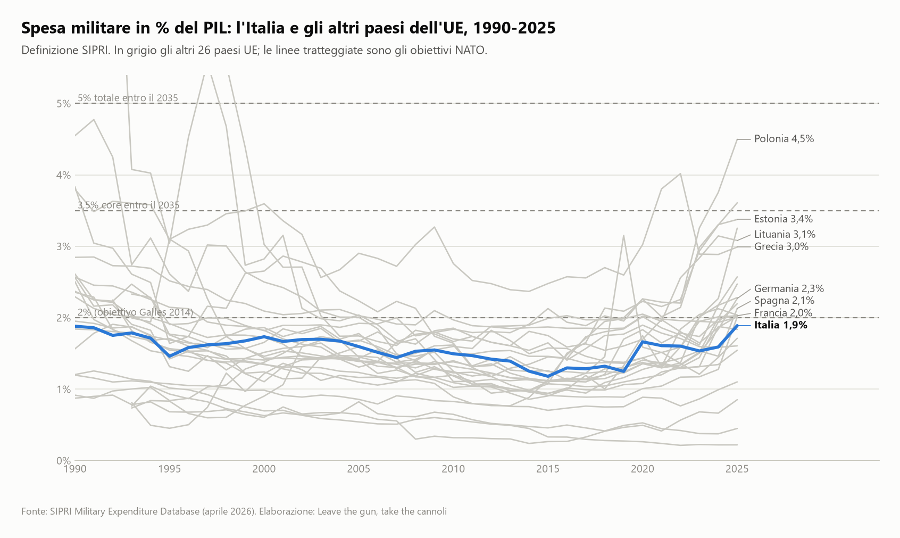
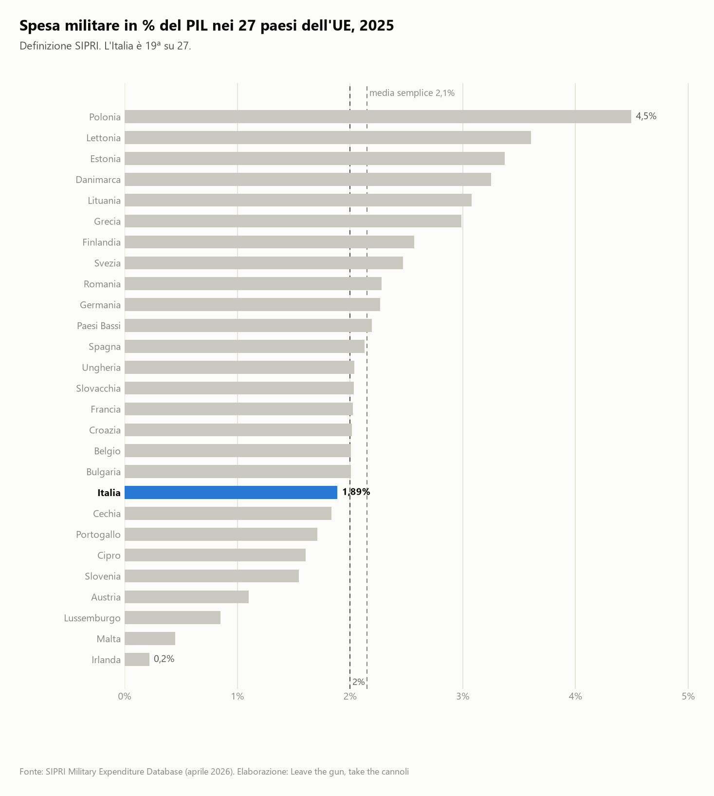
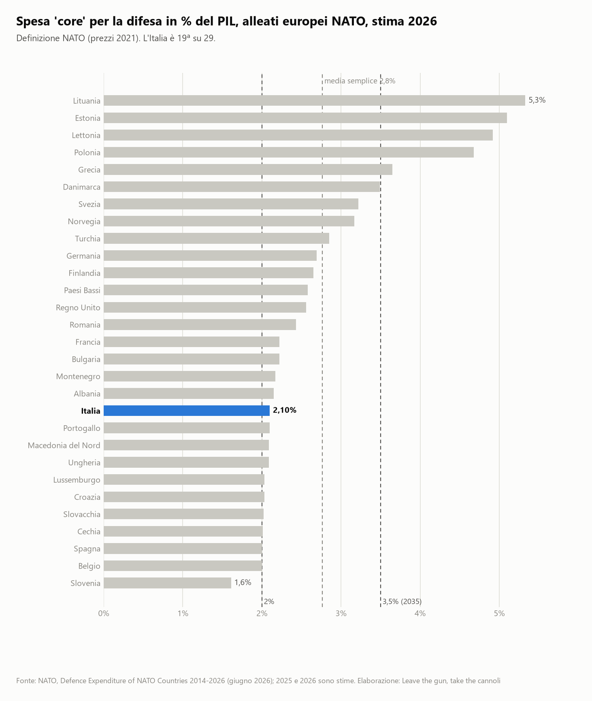
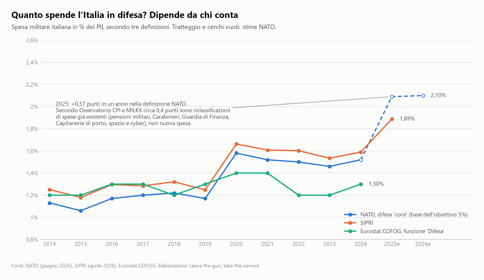
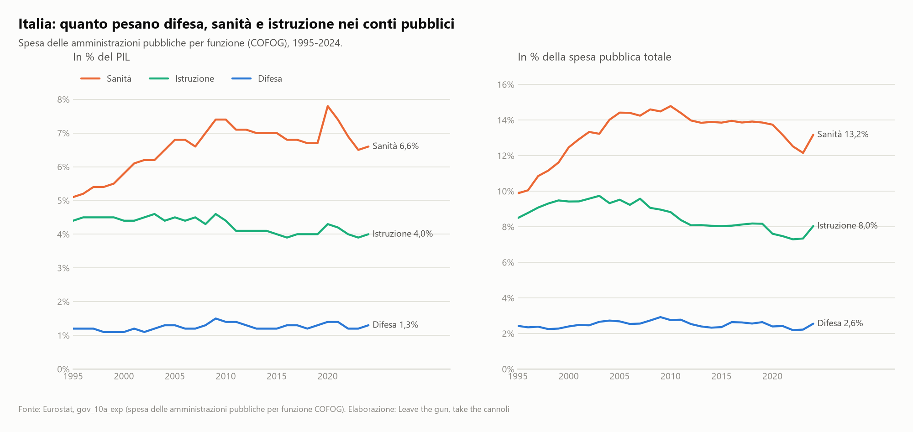
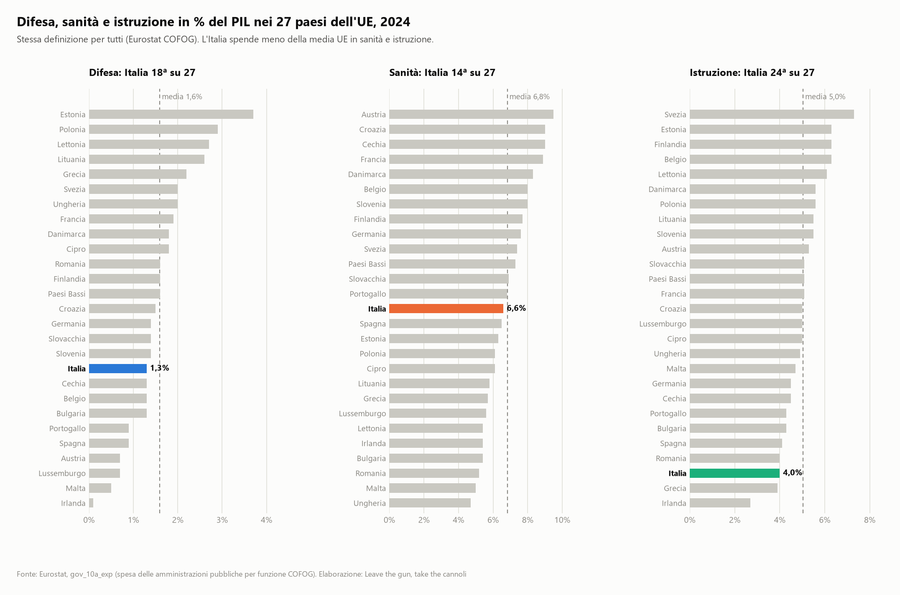
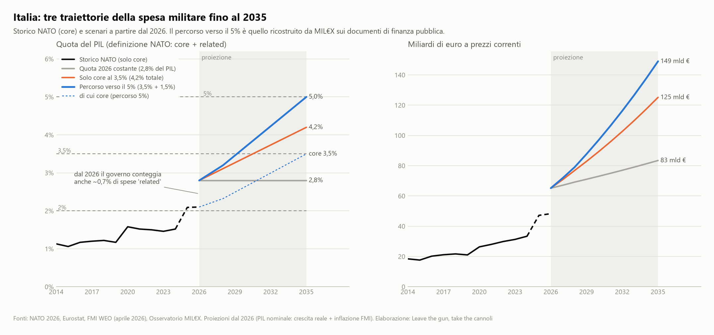
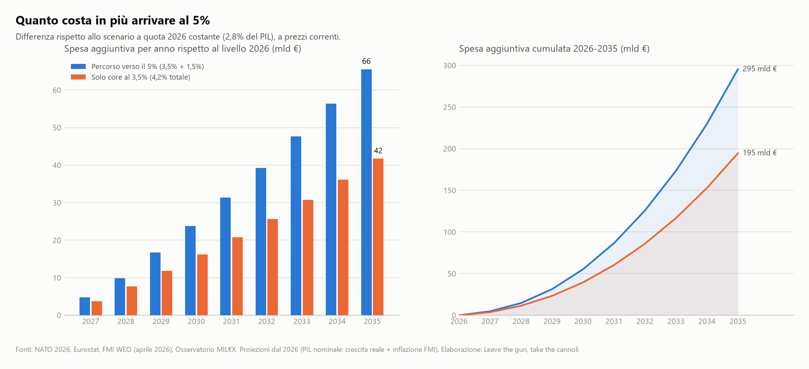
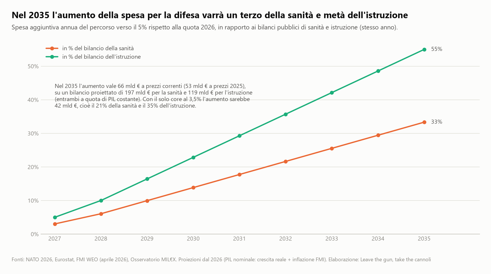
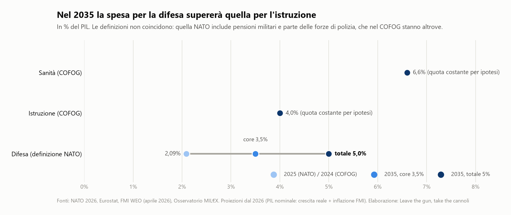

# Leave the gun, take the cannoli

**Quanto costerà all'Italia il 5% del PIL in spesa militare entro il 2035, e a cosa equivale rispetto a sanità e istruzione.**

> *"Leave the gun. Take the cannoli."* (Il Padrino, 1972). Lascia la pistola, prendi i cannoli: una pipeline di analisi
> dati sulla spesa militare europea e italiana, sul suo peso nei conti pubblici e sul costo del percorso verso l'obiettivo
> NATO del 5% del PIL fissato al vertice dell'Aia (giugno 2025).

*In English: a reproducible Python pipeline that compares European military spending (SIPRI, NATO, Eurostat COFOG),
focuses on Italy, and projects the cost of NATO's 5%-of-GDP target by 2035 against Italian public spending on health and
education. Charts and tables are generated from official sources with a single command.*

---

## I numeri in breve

| | |
|---|---|
| Spesa pubblica italiana 2024 in % del PIL (Eurostat COFOG) | difesa **1,3%** (28 mld €), istruzione **4,0%** (89 mld €), sanità **6,6%** (146 mld €), protezione sociale 21,3% |
| Spesa militare secondo la NATO (definizione "core") | 1,52% nel 2024 (33 mld €) → **2,09% nel 2025** (47 mld €): +0,57 punti in un anno, in gran parte riclassificazioni contabili |
| Posizione dell'Italia | 19ª su 27 nell'UE (SIPRI 2025); 19ª su 29 tra gli alleati europei NATO (2026); 24ª su 27 nell'UE per spesa in istruzione |
| Spesa per la difesa nel 2035 al 5% del PIL (definizione NATO allargata) | **~149 mld € all'anno** a prezzi correnti, pari a ~121 mld € a prezzi 2025 (di cui ~104 "core"), contro 65 mld € nel 2026 |
| Costo aggiuntivo nel solo 2035 rispetto alla quota 2026 | tra **42 mld €** (solo core al 3,5%) e **66 mld €** (5%): tra un quinto e un terzo del bilancio della sanità, tra un terzo e metà di quello dell'istruzione, tra 700 e 1.100 € per abitante |
| Costo aggiuntivo cumulato 2026-2035 | tra **195 e 295 mld €** a prezzi correnti (166-251 mld € a prezzi 2025): da 1,8 a 2,7 anni di spesa per l'istruzione, da 1,1 a 1,6 anni di spesa sanitaria |
| Peso della difesa sulla spesa pubblica (definizione NATO) | dal 4,1% del 2025 a circa il **10%** al 5% del PIL |

Tutti i numeri vengono da `python main.py` e sono ricalcolati ad ogni esecuzione: il riepilogo completo è in
[output/summary.md](output/summary.md), le tabelle in [output/tables](output/tables). I due estremi di ogni intervallo
sono lo scenario "solo core al 3,5%" (limite inferiore della nuova spesa) e il percorso completo al 5% (limite
superiore, perché parte della componente "related" potrebbe essere riclassificazione di spese già esistenti).

---

## L'analisi in dieci grafici

### 1. La spesa militare in Europa: trent'anni di calo, poi la risalita

Per trent'anni la spesa militare dei paesi UE è scesa; dal 2022 risale ovunque. L'Italia nel 2025 è all'1,9% del PIL
(definizione SIPRI), sotto la media UE e sotto la vecchia soglia NATO del 2%.





Nella definizione NATO (quella su cui si misura il 5%), l'Italia è al 2,1% nella stima 2026: esattamente sulla soglia e
un punto e mezzo sotto l'obiettivo "core" del 3,5%.



### 2. Quanto spende l'Italia? Dipende da chi conta

Tre fonti, tre definizioni, tre numeri diversi per lo stesso paese. Il salto del 2025 nella serie NATO (da 1,52% a
2,09%) non corrisponde a un aumento di spesa: secondo l'Osservatorio sui Conti Pubblici Italiani e MIL€X circa 0,4 punti
su 0,57 derivano dall'inclusione di voci prima escluse (pensioni del personale militare, quota dei Carabinieri, Guardia
di Finanza, Capitanerie di porto, spazio e cyber).



Un dettaglio che conta per leggere tutto il resto: nella definizione NATO circa il 60% della spesa "core" italiana è
personale (stipendi e pensioni) e solo un quarto è equipaggiamento (24,8% nella stima 2025). "Spesa per la difesa" non
significa quindi "spesa in armi": il confronto riguarda le risorse pubbliche assorbite dal comparto, non solo gli acquisti.

### 3. Difesa, sanità e istruzione nei conti pubblici italiani

Nel 2024 la sanità pesa per il 13,2% della spesa pubblica, l'istruzione per l'8,0%, la difesa per il 2,6%. L'istruzione
è in calo tendenziale da vent'anni, sia in % del PIL sia in quota di spesa.



A parità di definizione (Eurostat COFOG), l'Italia spende in istruzione meno di quasi tutti i paesi UE: 4,0% del PIL
contro una media del 5,0%.



### 4. Tre traiettorie fino al 2035

Il modello confronta tre scenari a partire dal livello 2026 (2,8% del PIL nella definizione allargata rivendicata dal
governo: 2,1% core + 0,7% "defence-related"):

- **quota 2026 costante** (2,8% del PIL, che in euro cresce con il PIL nominale): base per il calcolo del costo aggiuntivo;
- **solo core al 3,5%**: crescita lineare della sola difesa core, related fermo allo 0,7% (4,2% totale);
- **percorso verso il 5%**: la traiettoria ricostruita da MIL€X sui documenti di finanza pubblica (2,8% → ~3,2% nel
  2028 → 5% nel 2035).



### 5. Quanto costa in più, e rispetto a cosa







Per un confronto esterno: MIL€X (luglio 2026) stima in 498 mld € la spesa cumulata aggiuntiva 2025-2035 rispetto a una
base al 2% del PIL. Questo modello, con ipotesi indipendenti sul PIL, arriva a circa 507 mld € sull'orizzonte 2026-2035.

Gli importi cumulati sommano euro di anni diversi: a prezzi 2025 (deflazionando con l'inflazione FMI) i 295 mld € del
percorso al 5% diventano circa 251 mld €. I rapporti (quote di PIL, % di un bilancio, anni di bilancio) non dipendono
invece dall'inflazione.

---

## Metodologia

### Fonti

| Fonte | Cosa fornisce | Come viene letta |
|---|---|---|
| [Eurostat, `gov_10a_exp`](https://ec.europa.eu/eurostat/databrowser/view/gov_10a_exp) | Spesa delle amministrazioni pubbliche per funzione (COFOG): difesa, sanità, istruzione, ecc., in % del PIL e in milioni di euro, tutti i paesi UE, 1995-2024 | API JSON-stat |
| [Eurostat, `nama_10_gdp`](https://ec.europa.eu/eurostat/databrowser/view/nama_10_gdp) | PIL nominale | API JSON-stat |
| [SIPRI Military Expenditure Database](https://www.sipri.org/databases/milex) (aprile 2026) | Spesa militare 1949-2025, % PIL, dollari costanti, valuta locale, % della spesa pubblica | file Excel |
| [NATO, Defence Expenditure of NATO Countries](https://www.nato.int/en/what-we-do/introduction-to-nato/defence-expenditures-and-natos-5-commitment) (giugno 2026) | Spesa "core" 2014-2026e secondo la definizione NATO, in valuta nazionale, dollari e % del PIL; ripartizione per categoria | file Excel |
| [FMI, World Economic Outlook](https://www.imf.org/external/datamapper) (aprile 2026) | Crescita reale, inflazione, popolazione, debito e deficit dell'Italia con previsioni al 2031 | API DataMapper |
| [Osservatorio MIL€X](https://www.milex.org/2026/07/08/arrivare-al-5-costerebbe-oltre-500-miliardi/), [Osservatorio CPI](https://osservatoriocpi.unicatt.it/ocpi-pubblicazioni-maggiori-spese-nato-dell-italia-e-riclassificazioni-un-aggiornamento) | Percorso governativo verso il 5% e analisi delle riclassificazioni 2025 | parametri in `cannoli/config.py` |

### Tre definizioni di "spesa militare"

- **Eurostat COFOG, divisione 02 "Difesa"**: contabilità nazionale, stessa definizione per tutti i paesi UE. È la
  definizione usata per i confronti con sanità (07) e istruzione (09), così il confronto è omogeneo.
- **SIPRI**: include forze armate, forze paramilitari addestrate per operazioni militari, pensioni militari, R&S
  militare e aiuti militari. È la serie storica più lunga e coerente.
- **NATO "core defence"**: la definizione su cui si misurano gli impegni del 2% e del 3,5%; include pensioni e parte
  delle forze di polizia a ordinamento militare. Il 5% del vertice dell'Aia è la somma di 3,5% core e fino a 1,5% di spese
  "defence-related" (infrastrutture, cyber, resilienza civile), che la NATO non certifica ancora.

### Modello di proiezione (`cannoli/projections.py`)

1. **PIL nominale**: dal PIL 2025 Eurostat, cresciuto anno per anno con crescita reale e inflazione previste dal FMI fino
   al 2031, poi con i valori dell'ultimo anno disponibile fino al 2035 (2.258 mld € nel 2025 → ~2.980 mld € nel 2035 a
   prezzi correnti, ~2.414 mld € a prezzi 2025). L'inflazione al consumo è usata come approssimazione del deflatore del PIL.
2. **Inflazione e prezzi**: lo stesso indice dei prezzi (base 2025 = 1, ~1,235 nel 2035) serve a esprimere ogni importo
   anche a prezzi costanti 2025 (colonne `*_const` in `data/processed/italy_scenarios.csv`). Le quote di PIL e i rapporti
   fra bilanci sono indipendenti da questa scelta.
3. **Scenari**: traiettorie annue in % del PIL (definizione NATO, core + related), convertite in euro con il PIL proiettato.
4. **Costo aggiuntivo**: differenza rispetto allo scenario a quota 2026 costante (2,8% del PIL, che in euro cresce con il
   PIL nominale), anno per anno e cumulata.
5. **Confronti**: sanità e istruzione proiettate a quota di PIL costante (ultimo dato Eurostat), cioè uno scenario "a
   politiche invariate". Il costo aggiuntivo è espresso in % del bilancio dello stesso anno, in "anni di bilancio"
   (somma dei rapporti annui, quindi neutrale rispetto all'inflazione) e per abitante (popolazione FMI).

Tutti i parametri di policy (obiettivi, punto di partenza, tappe del percorso) sono in [`cannoli/config.py`](cannoli/config.py).

### Limiti

- La NATO misura le quote sul PIL a prezzi 2021; qui le quote sono applicate al PIL nominale, quindi gli importi sono a
  prezzi correnti e non direttamente confrontabili con quelli in dollari 2021 della NATO.
- Il livello 2026 del 2,8% include 0,7 punti di spese "related" rivendicate dal governo ma non ancora certificate.
- Il percorso 2,8% → 3,2% → 5% è una ricostruzione di MIL€X: il governo non ha pubblicato una traiettoria ufficiale anno
  per anno. Cambiare i punti in `GOV_PATH_WAYPOINTS` ricalcola tutto.
- Sanità e istruzione "a quota costante" non sono una previsione: servono a rendere leggibile l'ordine di grandezza. I
  documenti di finanza pubblica prevedono per la sanità una quota in lieve calo, il che renderebbe i rapporti più alti.
- Le definizioni NATO e COFOG non coincidono: pensioni militari e parte delle forze di polizia sono "difesa" per la NATO
  ma "protezione sociale" e "ordine pubblico" nel COFOG. I confronti fra difesa NATO e sanità/istruzione COFOG vanno
  letti come ordini di grandezza, non come voci omogenee di uno stesso bilancio.
- Nessuna ipotesi sulle coperture (debito, tagli, tasse): il modello misura il costo, non chi lo paga.

---

## Come si usa

Richiede Python 3.11+.

```bash
python -m venv .venv
```

```bash
.venv\Scripts\activate
```

```bash
pip install -r requirements.txt
```

```bash
python main.py
```

Opzioni: `--refresh` riscarica le fonti; `--from-processed` usa i CSV già in `data/processed` senza scaricare;
`--no-charts` produce solo tabelle e riepilogo. I test unitari (nessun accesso alla rete) si eseguono con:

```bash
python -m pytest
```

## Struttura del progetto

```
main.py                 entrypoint della pipeline
cannoli/
  config.py             costanti, fonti, parametri degli scenari
  countries.py          anagrafica paesi (codici Eurostat, nomi SIPRI/NATO, nomi italiani)
  sources.py            download con cache locale (Eurostat, SIPRI, NATO, FMI)
  transform.py          conversione delle fonti in CSV tidy
  projections.py        proiezione del PIL e scenari 2026-2035
  style.py              palette e stile dei grafici
  charts.py             i dieci grafici
  report.py             tabelle CSV e riepilogo Markdown
data/
  raw/                  file scaricati (ignorati da git, rigenerabili)
  processed/            CSV tidy prodotti dalla pipeline
output/
  charts/               grafici PNG
  tables/               tabelle CSV
  summary.md            riepilogo dei risultati
tests/                  test unitari (pytest)
```

## Licenza

Il codice è rilasciato con licenza MIT (vedi [LICENSE](LICENSE)). I dati e i grafici derivati restano soggetti alle
condizioni delle rispettive fonti, indicate nella nota qui sotto.

## Nota

Questo è un progetto personale di analisi dei dati, nato per rispondere a una domanda concreta: quanto costa all'Italia
il percorso verso il 5% del PIL e a cosa corrisponde quella cifra rispetto alle altre voci della spesa pubblica. Il
modello misura un costo-opportunità; non valuta i benefici dell'impegno in termini di sicurezza né le possibili
ricadute economiche (occupazione, industria, moltiplicatori), che restano fuori dal perimetro. Dati, codice e ipotesi
sono pubblici e riproducibili: chiunque può cambiare i parametri in `cannoli/config.py` e ottenere i propri numeri.

I dati appartengono alle rispettive fonti e sono usati nei limiti delle loro condizioni: Eurostat (CC BY 4.0), NATO e
FMI con attribuzione. Per SIPRI vale la dicitura richiesta dai suoi termini d'uso: *Information from the Stockholm
International Peace Research Institute (SIPRI), https://www.sipri.org/databases/milex*. L'estratto completo SIPRI
(`data/processed/sipri_milex.csv`) non è incluso nel repository perché eccede la soglia di riuso libero del 10% del
dataset: viene rigenerato in locale da `python main.py`, che scarica il file originale dal sito SIPRI.
